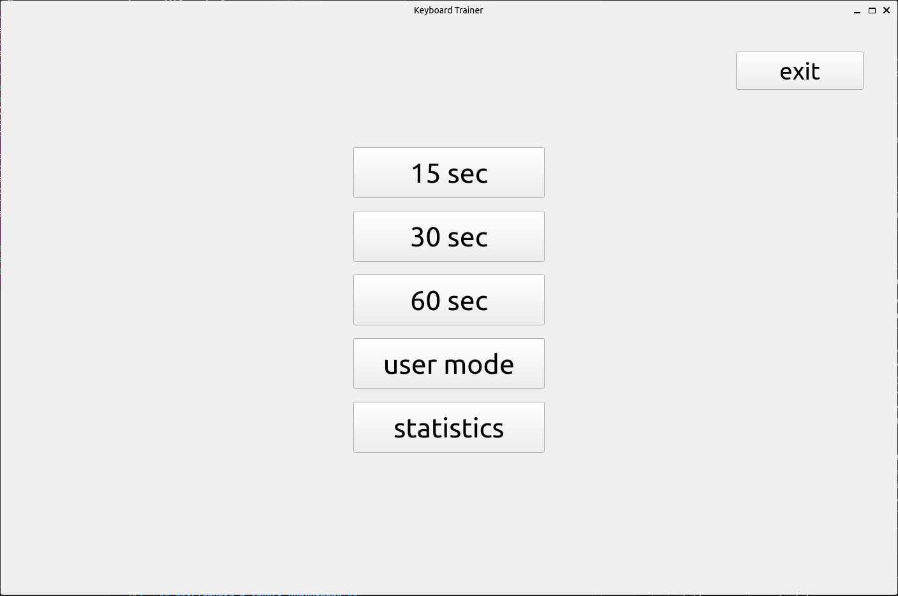
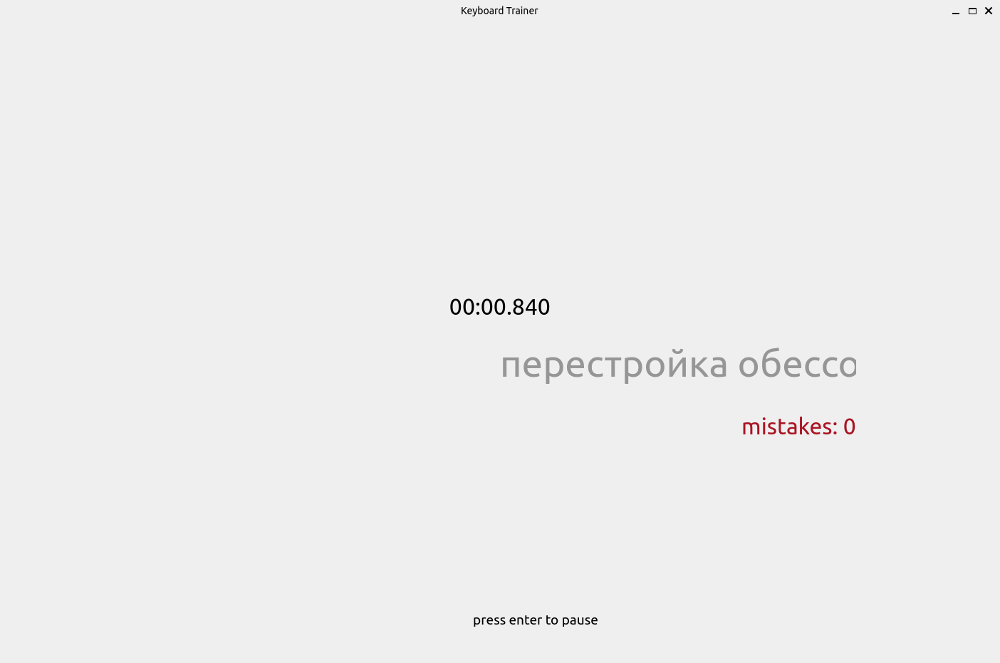
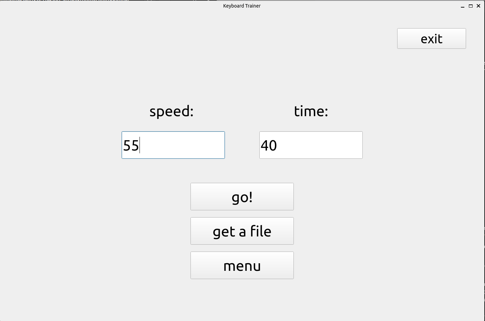
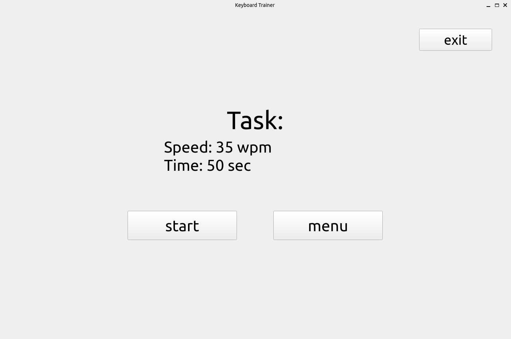
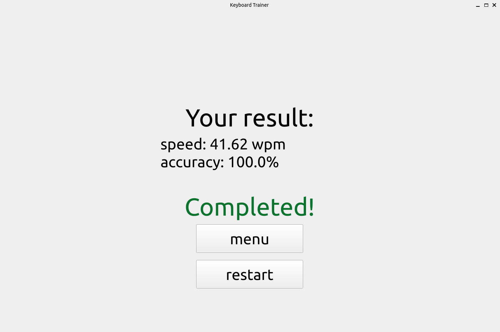
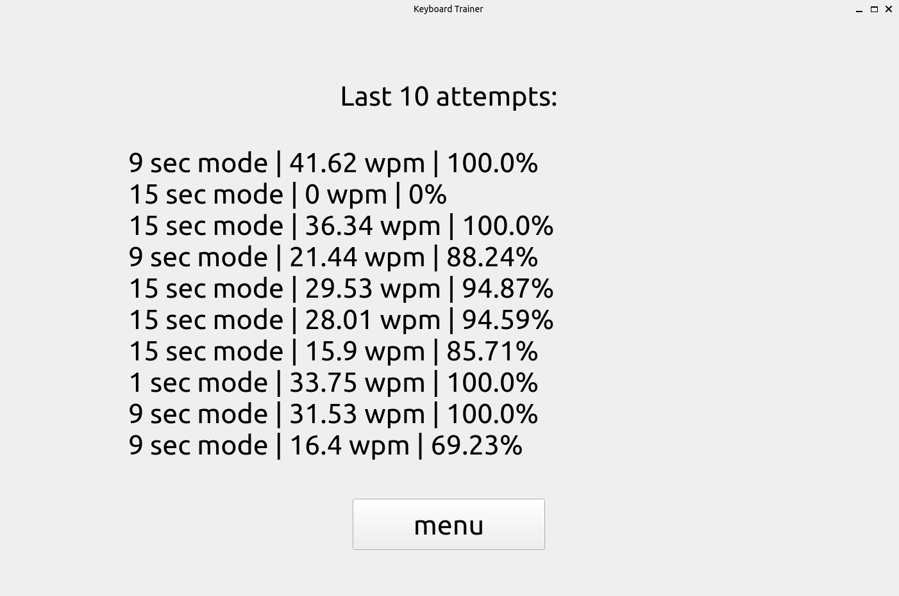

 # **Keyboard Trainer**
 
 ## **Краткое описание:**
 Это приложение представляет собой клавиатурный тренажер, который поможет развить навык быстрой печати. Кроме встроенных режимов здесь есть возможность создавать собственные задания, выполнять их и делиться с другими.
____
 ## **Базовый функционал:**
 * ### Строка, которую нужно напечатать пользователю и поле для ввода. Не разрешено печатать неправильные символы.
    (_Строка рандомно генерируется из списка русских слов, при попытке пользователя напечатать неверный символ строка загорается красным, и остается такой до тех пор, пока пользователь не введет правильную букву_)

 * ### Возможность пользователю создавать собственные задания
    (_Пользователь может задать ограничение времени в секундах, и желаемую скорость_)

 * ### Формат для заданий и загрузка, получение файлов в этом формате
    (_Задания можно сохранить и загрузить в формате *.txt, в файле написано ограничение времени в секундах и скорость_)

 * ### Подсчет количества ошибок и скорости печати, сохранение статистики между запусками
    (_В папке проекта хранится документ с информацией о результатах последних десяти попыток_)
____
 ## **Использование:**

При запуске приложения открывается главное меню. Здесь есть 5 основных кнопок: `15 sec`, `30 sec`, `60 sec`, `user mode`, `statistics`, а также кнопка выхода из приложения: `exit`



<!--  -->

Первые три кнопки переводят пользователя в режим, где ему дается соответсвующее количество секунд на попытку. При нажатии на каждую из них начинается обратный отсчет, после которого запусается таймер и пользователю дается возможность печатать. Чтобы поставить попытку на паузу, нужно нажать `Enter`


<!--  -->

Нажимая "user mode", пользователь может выбрать - создать свое собственное задание (кнопка `create task`) или загрузить в приложение файл в формате *.txt, в котором содержится описание задания (кнопка `upload task`).

Создание своего задания - это установка времени и скорости печати. После этого пользователь может получить файл с описанием задания, просто выполнить его или вернуться в главное меню.



При загрузке файла с компьютера, пользователь сначала видит информацию о задании, после чего может выполнить его, нажав кнопку `start` или вернуться в главное меню (кнопка `menu`).



После каждой попытки пользователь попадает на страницу, где написаны его результаты: скорость и точность печати. Любую попытку можно повторить (кнопка `restart`) или вернуться в главное меню (кнопка `menu`). Если пользователь выполнял задание, то в конце он получает вердикт - выполнено оно или нет.



Кнопка `statistics`  в главном меню переводит пользователя на страницу статистики, где отражена информация о результатах последних 10и попыток.



____
 ## **Установка и запуск приложения:**
```
git clone -b main git@github.com:mashazatsepina/Keyboard_trainer.git
cd Keyboard_trainer
pip install -r requirements.txt
python3 main.py
```